# Sistema de Reservas Tolerante a Fallos


> Practica completa de tolerancia a fallos para un sistema de venta de entradas desplegado sobre Kubernetes. Incluye arquitectura multinodo, seis componentes, cuatro mecanismos de resiliencia implementados, inyección real de fallos, métricas, evidencias y análisis de producción de los dos escenarios restantes.

| Información | Detalle |
|---|---|
| Asignatura | Tolerancia a fallos |
| Modalidad | Trabajo individual |
| Estudiante | **Alex Guaman** |
| Fecha de ejecución | 12 de julio de 2026 |
| Infraestructura | kind: 1 control-plane + 2 workers |
| Estado | Implementado, ejecutado y verificado |

## Tabla de contenido

1. [Resumen ejecutivo](#resumen-ejecutivo)
2. [Objetivos y alcance](#objetivos-y-alcance)
3. [Arquitectura](#arquitectura)
4. [Componentes](#componentes)
5. [Despliegue](#despliegue)
6. [Catálogo de fallos](#catálogo-de-fallos)
7. [Mecanismos de resiliencia](#mecanismos-de-resiliencia)
8. [Ejecución y evidencias](#ejecución-y-evidencias)
9. [Galería completa de capturas](#galería-completa-de-capturas)
10. [Análisis de los fallos restantes](#análisis-de-los-fallos-restantes)
11. [Guion de demostración](#guion-de-demostración)
12. [Estructura del repositorio](#estructura-del-repositorio)
13. [Conclusiones y limitaciones](#conclusiones-y-limitaciones)

## Resumen ejecutivo

El proyecto implementa una arquitectura simplificada de venta de entradas compuesta por API Gateway, Reservas, Inventario, Pagos, Notificaciones y PostgreSQL. Los componentes se comunican mediante REST y se despliegan en un clúster Kubernetes de tres nodos.

Gateway, Reservas e Inventario poseen dos réplicas con anti-afinidad obligatoria, por lo que cada réplica se ejecuta en un worker diferente. La solución implementa timeout, retries con backoff y jitter, circuit breaker, bulkhead, fallback, probes, límites de recursos, PodDisruptionBudget y HPA.

Se ejecutaron realmente cuatro escenarios de caos:

- eliminación de un pod de Inventario;
- respuesta de Pagos con 20 segundos de latencia;
- carga de 80 usuarios virtuales durante 30 segundos;
- caída total de Notificaciones.

Los experimentos demostraron recuperación, errores controlados y aislamiento de dependencias. La conectividad intermitente con PostgreSQL y la condición de carrera por el último asiento se desarrollan mediante análisis teórico, solución de producción y pseudocódigo.

## Objetivos y alcance

### Objetivo general

Demostrar que un sistema distribuido puede continuar funcionando o fallar de manera controlada cuando se eliminan pods, aparecen dependencias lentas, existe sobrecarga o deja de estar disponible un servicio no crítico.

### Objetivos específicos

- Desplegar los seis componentes exigidos en Kubernetes.
- Distribuir componentes críticos entre al menos dos nodos.
- Relacionar cada fallo con un mecanismo técnico de inyección.
- Implementar defensas para cuatro de los seis escenarios.
- Ejecutar los fallos sobre el clúster real y conservar evidencia reproducible.
- Analizar rigurosamente los dos fallos restantes.
- Preparar una demostración de 10 a 15 minutos.

## Arquitectura

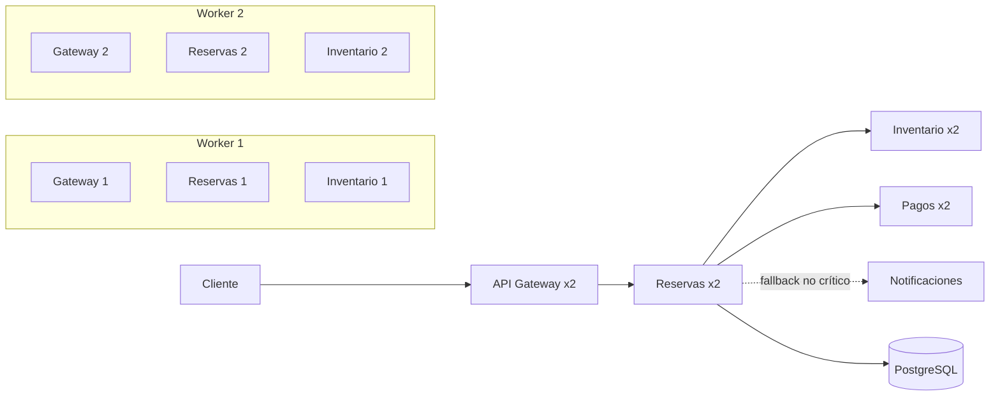

### Distribución comprobada

| Componente | Réplicas | Distribución | Función |
|---|---:|---|---|
| API Gateway | 2 | Un pod por worker | Entrada, timeout global y bulkhead |
| Reservas | 2 | Un pod por worker | Orquestación de compra y resiliencia |
| Inventario | 2 | Un pod por worker | Disponibilidad y descuento de asientos |
| Pagos | 2 | Ambos workers | Cobro simulado con latencia y fallos |
| Notificaciones | 1 | Worker disponible | Envío de correo no crítico |
| PostgreSQL | 1 | Worker disponible | Persistencia de reservas |

La anti-afinidad `requiredDuringSchedulingIgnoredDuringExecution` evita que las dos réplicas críticas terminen en el mismo nodo. La estrategia de despliegue usa `maxSurge: 0` y `maxUnavailable: 1` para permitir actualizaciones sin bloquear el scheduler cuando solo existen dos workers.

## Componentes

### API Gateway

- Expone `POST /api/comprar`.
- Limita cada pod a 40 solicitudes concurrentes.
- Responde HTTP 503 con `Retry-After` cuando el bulkhead se llena.
- Aplica un presupuesto HTTP máximo de 6,5 segundos.
- Propaga un `requestId` para correlacionar logs.

### Servicio de Reservas

- Coordina Inventario, Pagos, PostgreSQL y Notificaciones.
- Reintenta errores transitorios hasta tres veces.
- Usa backoff exponencial con jitter.
- Mantiene circuit breakers independientes para Inventario y Pagos.
- Registra la reserva en PostgreSQL.
- Trata Notificaciones como dependencia no crítica.

### Inventario

- Expone `POST /descontar`.
- Rechaza un asiento ocupado con HTTP 409.
- Reconoce el mismo `requestId` como una repetición idempotente.
- Usa memoria solo para mantener la práctica pequeña; la solución transaccional de producción se explica más adelante.

### Pagos

- Simula una pasarela externa.
- Permite configurar `FIXED_DELAY_MS` para inyectar latencia.
- Puede producir fallos aleatorios configurables.
- Devuelve un identificador de transacción correlacionado.

### Notificaciones

- Simula un proveedor de correo.
- Introduce latencia variable y fallos aleatorios.
- Puede escalarse a cero para demostrar el fallback.

### PostgreSQL

- Conserva las reservas confirmadas.
- Limita el pool de Reservas a ocho conexiones.
- Mantiene una clave primaria por `request_id`.
- Representa el almacén autoritativo para el análisis de producción.

## Requisitos

- Docker Desktop;
- `kubectl`;
- kind;
- PowerShell 7;
- al menos 6 GB de memoria disponible para Docker.

Instale kind desde su distribución oficial y confirme que el comando `kind` esté disponible en `PATH`.

## Despliegue

### 1. Crear el clúster

```powershell
kind create Clúster `
  --name tolerancia-fallos `
  --config kind-config.yaml
```

### 2. Construir las imágenes

```powershell
docker build -t api-gateway:latest ./api-gateway
docker build -t reservas:latest ./reservas
docker build -t inventario:latest ./inventario
docker build -t pagos:latest ./pagos-stub
docker build -t notificaciones:latest ./notificaciones-stub
```

### 3. Cargar las imágenes en los nodos

```powershell
$images = @(
  'api-gateway:latest',
  'reservas:latest',
  'inventario:latest',
  'pagos:latest',
  'notificaciones:latest'
)

$images | ForEach-Object {
  kind load docker-image $_ --name tolerancia-fallos
}
```

### 4. Aplicar los manifiestos

```powershell
kubectl apply -f k8s-manifests/
kubectl wait --for=condition=available deployment --all --timeout=240s
kubectl get nodes -o wide
kubectl get pods -o wide
```

### 5. Activar métricas para el HPA

```powershell
kubectl apply -f https://github.com/kubernetes-sigs/metrics-server/releases/download/v0.8.1/components.yaml
kubectl patch deployment metrics-server -n kube-system --type=json `
  -p='[{"op":"add","path":"/spec/template/spec/containers/0/args/-","value":"--kubelet-insecure-tls"}]'
kubectl rollout status deployment/metrics-server -n kube-system
kubectl top nodes
kubectl get hpa
```

### 6. Prueba funcional

```powershell
kubectl port-forward service/api-gateway 3001:3001

curl.exe -X POST http://localhost:3001/api/comprar `
  -H "Content-Type: application/json" `
  -d '{"seatId":"A-10","amount":25,"email":"alumno@example.com"}'
```

Resultado esperado:

```json
{
  "success": true,
  "seatId": "A-10",
  "message": "Reserva confirmada"
}
```

## Catálogo de fallos

| # | Escenario | Tipo | Inyección | Defensa o solución |
|---:|---|---|---|---|
| 1 | Inventario fantasma | Disponibilidad | Eliminar un pod mientras existe tráfico | Réplicas, anti-afinidad, probes, retry y circuit breaker |
| 2 | Pasarela lenta | Latencia | `FIXED_DELAY_MS=20000` en Pagos | Timeout, retry acotado y circuit breaker |
| 3 | Diluvio de peticiones | Sobrecarga | Job k6 con 80 VU durante 30 s | Bulkhead, límites y HPA |
| 4 | Base de datos intermitente | Conectividad | Toxiproxy o NetworkPolicy alternante | Idempotencia, pool acotado, transacciones y outbox |
| 5 | Correo perdido | Fallo no crítico | Escalar Notificaciones a cero | Fallback y diferimiento del correo |
| 6 | Condición de carrera | Consistencia | Clientes simultáneos para el último asiento | Operación atómica y restricción única |

Los escenarios 1, 2, 3 y 5 fueron implementados y ejecutados. Los escenarios 4 y 6 constituyen el análisis técnico requerido.

## Mecanismos de resiliencia

### Retry con backoff y jitter

Reservas reintenta únicamente errores potencialmente transitorios. Los conflictos HTTP 4xx no se reintentan. Cada espera aumenta exponencialmente y añade una pequeña variación aleatoria para evitar que todas las réplicas reintenten al mismo tiempo.

### Circuit breaker

Inventario y Pagos poseen circuitos separados. Después de fallos consecutivos el circuito permanece abierto durante 15 segundos, evitando insistir sobre una dependencia degradada y liberando recursos del servicio.

### Bulkhead

Cada Gateway permite como máximo 40 solicitudes activas. Al superar el límite responde HTTP 503 con `Retry-After: 1`. La sobrecarga queda contenida y no consume indefinidamente memoria, sockets ni event-loop.

### Fallback

El correo no pertenece al camino crítico de la compra. Si Notificaciones falla, Reservas confirma la entrada y registra `notification_deferred`. En producción este registro debe convertirse en un evento Transactional Outbox consumido de manera asíncrona.

### Resiliencia de Kubernetes

- réplicas distribuidas mediante anti-afinidad;
- readiness y liveness probes;
- solicitudes y límites de CPU/memoria;
- PodDisruptionBudget con al menos una réplica disponible;
- HPA entre dos y seis réplicas de Gateway;
- recreación automática de pods eliminados.

## Ejecución y evidencias

La siguiente captura fue generada desde los resultados reales almacenados en `evidence/`.

*Dashboard de resultados reales*

### Estado inicial

Se comprobaron tres nodos `Ready`. Gateway, Reservas e Inventario tenían dos réplicas distribuidas entre `tolerancia-fallos-worker` y `tolerancia-fallos-worker2`.

Evidencias: [`00-nodos.txt`](evidence/00-nodos.txt), [`00-pods-iniciales.txt`](evidence/00-pods-iniciales.txt) y [`00-compra-base.txt`](evidence/00-compra-base.txt).

### Fallo 1: Inventario fantasma

Se eliminó una réplica de Inventario durante una compra. La otra réplica continuó atendiendo y el Deployment creó un pod de reemplazo.

```text
pod "inventario-...-d6bnk" deleted
HTTP: 201
RESPUESTA: Reserva confirmada
inventario-...-wc7rb   1/1   Running
```

**Resultado:** el fallo de un pod no eliminó la disponibilidad del servicio.

Evidencia completa: [`01-inventario-fantasma.txt`](evidence/01-inventario-fantasma.txt).

### Fallo 2: Pasarela lenta

Pagos fue configurado con 20 segundos de latencia. Reservas agotó tres intentos de 2,5 segundos y el Gateway respetó el presupuesto global.

```text
HTTP: 504
LATENCIA_CLIENTE_MS: 6535
dependency_retry payment attempt=1
dependency_retry payment attempt=2
dependency_retry payment attempt=3
```

**Resultado:** el usuario recibió un error reintentable y acotado, sin esperar los 20 segundos de la dependencia.

Evidencia completa: [`02-pasarela-lenta.txt`](evidence/02-pasarela-lenta.txt).

### Fallo 3: Diluvio de peticiones

k6 ejecutó 80 usuarios virtuales durante 30 segundos.

| Métrica | Resultado |
|---|---:|
| Solicitudes totales | 29 952 |
| Rendimiento | 951,22 req/s |
| Checks controlados | 100% |
| Latencia promedio | 80,77 ms |
| Latencia p95 | 540,97 ms |
| Estados aceptados | 201, 503 y 504 |

Los logs registraron `bulkhead_rejected` con `active=40` y `maxConcurrent=40`.

**Resultado:** el sistema conservó respuestas explícitas bajo saturación; no quedaron solicitudes indefinidamente colgadas.

Evidencia completa: [`03-diluvio-peticiones.txt`](evidence/03-diluvio-peticiones.txt).

### Fallo 4: Correo perdido

Notificaciones se escaló a cero réplicas y se realizó una compra.

```text
HTTP: 201
reservation_completed seatId=FALLO4-001
notification_deferred
connect ECONNREFUSED notificaciones:3005
```

**Resultado:** la caída de una capacidad no crítica no anuló la reserva ni el pago.

Evidencia completa: [`04-correo-perdido.txt`](evidence/04-correo-perdido.txt).

### Métricas y estado final

Metrics Server quedó activo y el HPA comenzó a recibir CPU:

```text
api-gateway   Deployment/api-gateway   cpu: 1%/60%   2   6   2
```

Evidencias: [`05-estado-final.txt`](evidence/05-estado-final.txt), [`06-metricas-nodos.txt`](evidence/06-metricas-nodos.txt), [`06-metricas-pods.txt`](evidence/06-metricas-pods.txt), [`06-hpa-final.txt`](evidence/06-hpa-final.txt) y [`07-verificacion-final.txt`](evidence/07-verificacion-final.txt).

## Galería completa de capturas

Las 18 imágenes están centralizadas en `img/` y comparten el estilo CodeSnap: fondo uniforme, ventana oscura, controles y título identificable. Las diez capturas de código incluyen además nombre de archivo y números de línea reales.

### Vistas generales

| Proyecto completo | Arquitectura |
|---|---|
| *Proyecto completo* | *Arquitectura* |
*(Imágenes generales documentadas en los archivos de texto de `evidence/`)*

| Clúster real | Documentación |
|---|---|
| *Clúster real* | *Documentación* |

### Código de los servicios - CodeSnap

| API Gateway | Reservas: resiliencia |
|---|---|
| 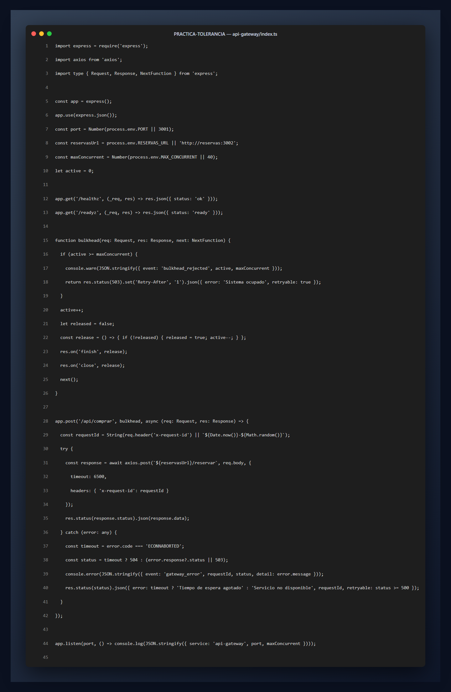 | 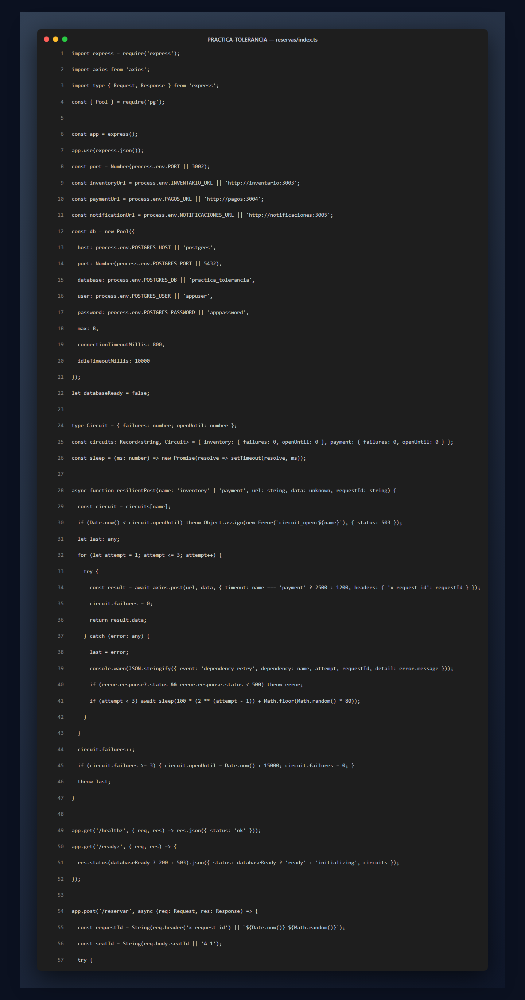 |

| Reservas: compra y arranque | Inventario |
|---|---|
| 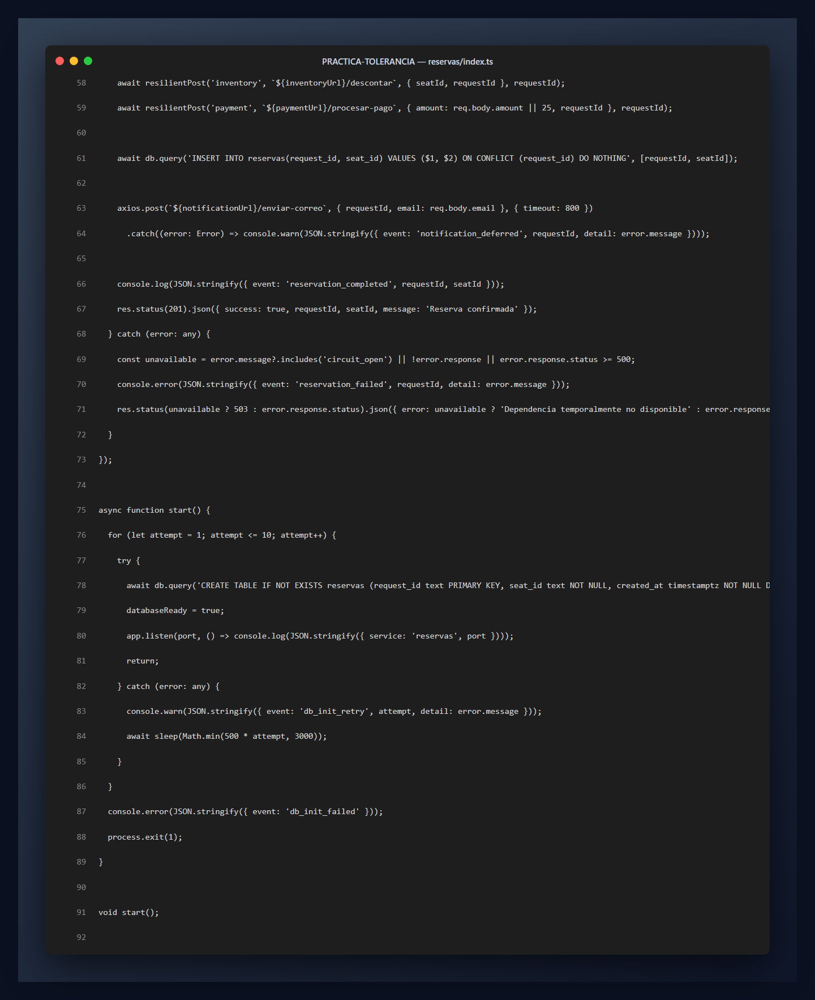 | 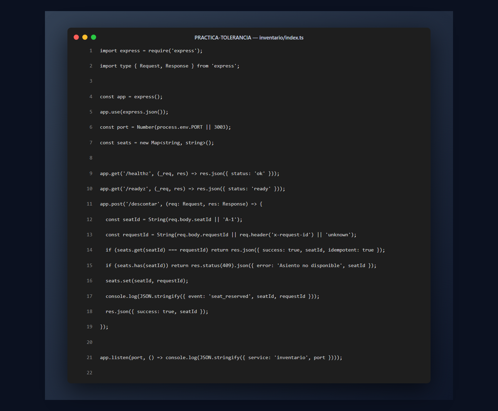 |

| Pagos | Notificaciones |
|---|---|
| 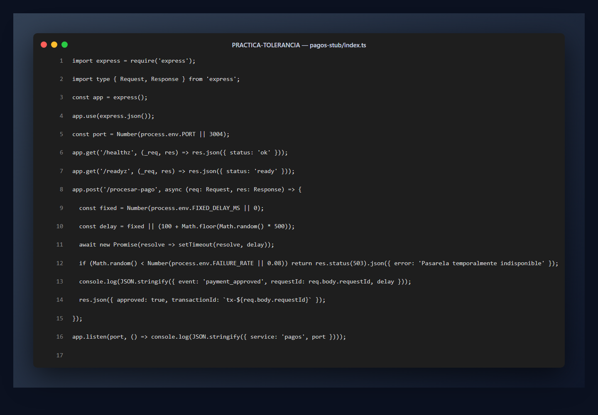 | 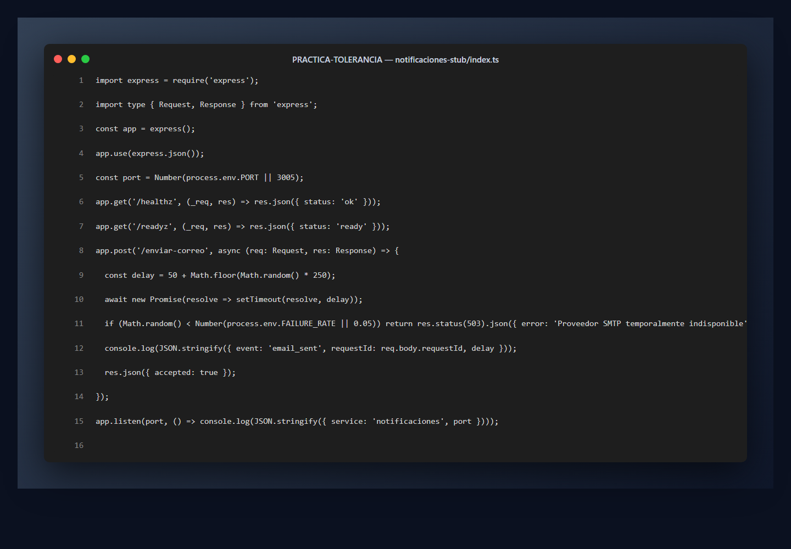 |

### Kubernetes y caos - CodeSnap

| Deployment de Reservas | PDB y HPA |
|---|---|
| 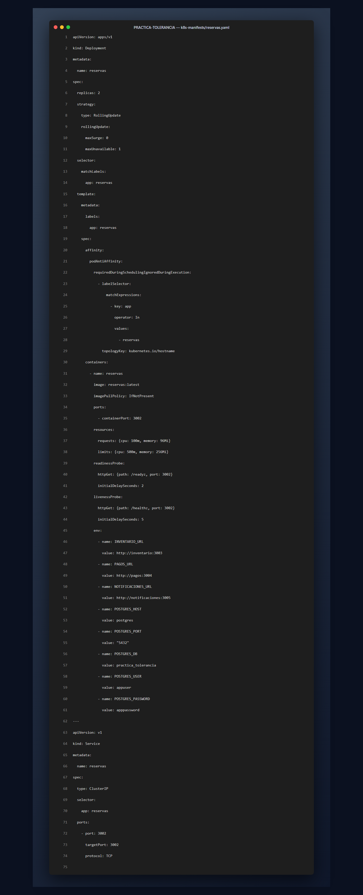 | 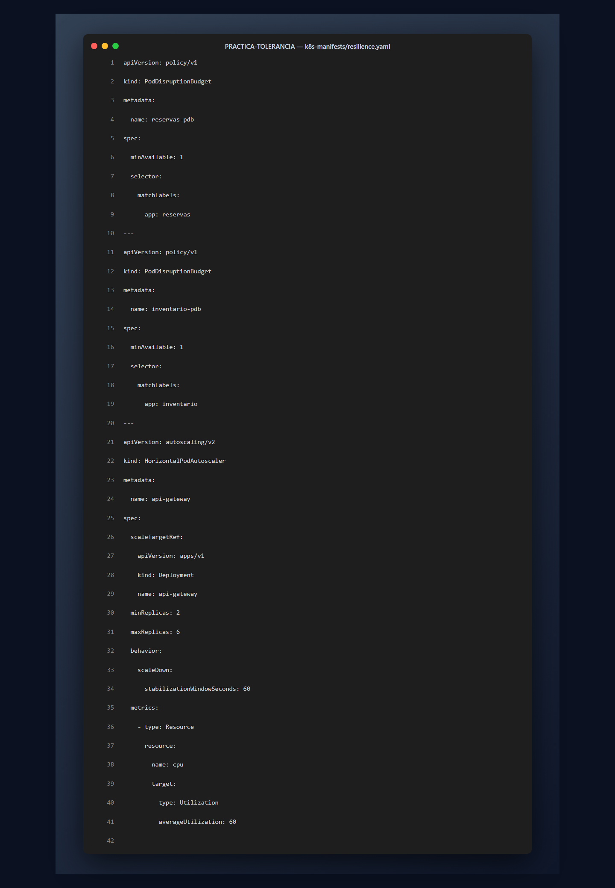 |

| Carga k6 | Clúster multinodo |
|---|---|
| 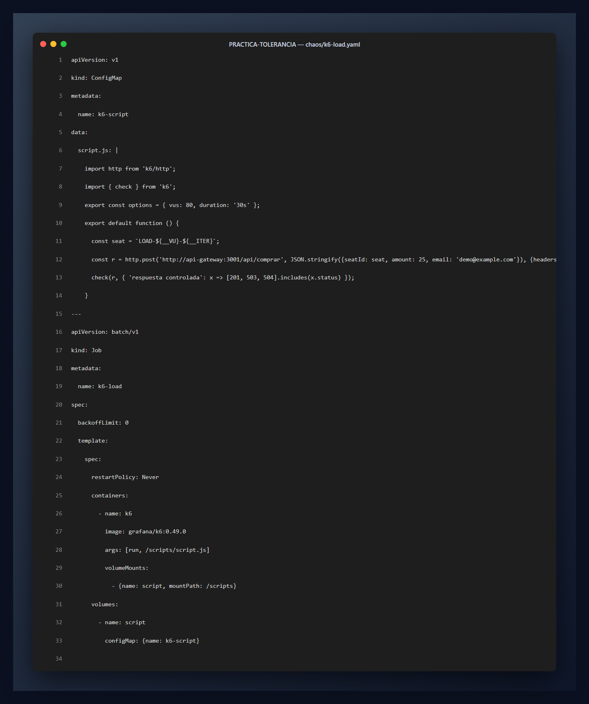 | 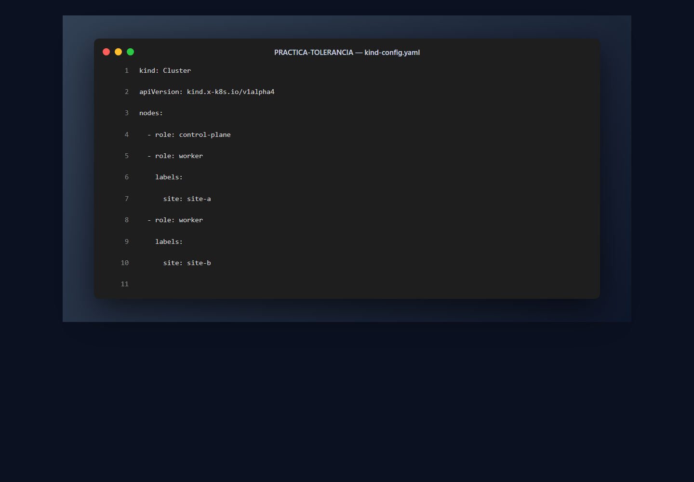 |

## Análisis de los fallos restantes

### Base de datos intermitente

Una interrupción puede ocurrir antes, durante o después del `COMMIT`. Si PostgreSQL confirma pero la respuesta se pierde, el cliente desconoce el resultado. Reintentar ciegamente puede duplicar la reserva o el cobro.

Durante una partición, CAP obliga a decidir entre aceptar una escritura sin confirmar la autoridad o preservar la consistencia. Para el último asiento se prioriza consistencia: si no puede confirmarse PostgreSQL, se responde HTTP 503 reintentable.

#### Solución de producción

1. Clave de idempotencia única por compra.
2. Pool de conexiones limitado mediante PgBouncer.
3. Transacción corta para reserva, solicitud y Outbox.
4. Retry solo para SQLSTATE transitorio.
5. Consulta por clave ante un resultado ambiguo.
6. Métricas de conexiones, espera, p95/p99, abortos y lag.

```text
comprar(cmd, key):
  previo = SELECT respuesta WHERE clave = key
  si existe: retornar previo
  BEGIN SERIALIZABLE
  INSERT solicitud(key, 'EN_PROCESO')
  reservar_asiento_atomico(cmd.seatId)
  INSERT reserva(...)
  INSERT outbox('ReservaCreada', payload)
  UPDATE solicitud SET estado='COMPLETA'
  COMMIT
  ante resultado ambiguo: consultar key antes de repetir
```

### Condición de carrera

Con “leer disponibilidad y luego descontar”, dos transacciones pueden observar simultáneamente el último asiento como disponible. Un mutex local no sirve porque existen múltiples pods y desaparece al reiniciar.

El invariante debe residir en PostgreSQL: para cada evento y asiento solo puede existir una reserva activa.

#### Solución de producción

- `UPDATE ... WHERE status='AVAILABLE' RETURNING`;
- o `SELECT ... FOR UPDATE` dentro de una transacción corta;
- restricción única `(event_id, seat_id)`;
- holds con expiración;
- pago idempotente;
- saga que confirma o libera el hold.

```text
crearHold(eventId, seatId, buyerId, key):
  BEGIN
  INSERT hold(...)
    ON CONFLICT(event_id, seat_id) DO NOTHING
  si filas = 0: ROLLBACK; retornar 409
  UPDATE seat SET status='HELD'
  COMMIT; retornar 201
```

La prueba determinista debe lanzar 50 clientes sincronizados para un único asiento y comprobar exactamente un HTTP 201, cuarenta y nueve HTTP 409, una reserva confirmada y ningún cobro duplicado.

El desarrollo ampliado está en [`docs/informe_tecnico.md`](docs/informe_tecnico.md) y en el [informe PDF entregable](docs/informe_tecnico.pdf).

## Guion de demostración

| Tiempo | Actividad |
|---:|---|
| 0:00-2:00 | Mostrar los tres nodos, pods y distribución |
| 2:00-4:00 | Ejecutar Inventario fantasma y mostrar HTTP 201 |
| 4:00-7:00 | Activar Pagos lento y explicar timeout/retries |
| 7:00-10:00 | Ejecutar k6 y mostrar bulkhead/métricas |
| 10:00-12:00 | Escalar Notificaciones a cero y mostrar fallback |
| 12:00-14:00 | Restaurar, comprobar pods y presentar conclusiones |

El guion detallado está en [`docs/guion_demostracion.md`](docs/guion_demostracion.md).

## Comandos de caos

```powershell
.\chaos\01-inventario-fantasma.ps1
.\chaos\02-pasarela-lenta.ps1
.\chaos\03-diluvio-peticiones.ps1
.\chaos\04-correo-perdido.ps1
.\chaos\restaurar.ps1
```

## Estructura del repositorio

```text
PRACTICA-TOLERANCIA/
├── api-gateway/             # Entrada y bulkhead
├── reservas/                # Orquestación, retries y circuit breaker
├── inventario/              # Disponibilidad de asientos
├── pagos-stub/              # Pasarela simulada
├── notificaciones-stub/     # Correo simulado
├── k8s-manifests/           # Deployments, Services, PDB y HPA
├── chaos/                   # Inyectores y restauración
├── evidence/                # Evidencia original de ejecución
├── img/                     # Todas las imágenes con estilo CodeSnap
├── docs/           # Documentos finales para entregar
├── tools/                   # Generadores reproducibles del PDF y capturas
├── kind-config.yaml         # Clúster de tres nodos
└── README.md                # Informe integral
```

## Guía completa de carpetas y archivos

Esta sección explica todo lo que permanece en el proyecto. Ningún archivo se conserva como residuo: cada elemento participa en la ejecución, despliegue, evidencia, documentación o reproducción de la entrega.

### Archivos de la raíz

| Archivo | Función |
|---|---|
| `.gitignore` | Evita subir dependencias, builds, logs, variables de entorno y archivos temporales. |
| `README.md` | Informe integral, instrucciones de ejecución, resultados, análisis y guía del repositorio. |
| `kind-config.yaml` | Define el clúster local con un control-plane y dos workers. |

### Servicios de aplicación

Cada servicio contiene únicamente los siguientes archivos técnicos:

| Archivo | Por qué es necesario |
|---|---|
| `index.ts` | Implementación del servicio. |
| `Dockerfile` | Construcción multietapa de la imagen de producción. |
| `.dockerignore` | Excluye dependencias y builds del contexto Docker. |
| `package.json` | Dependencias y comandos `build`/`start`. |
| `package-lock.json` | Fija versiones para instalaciones reproducibles con `npm ci`. |
| `tsconfig.json` | Configuración de compilación TypeScript hacia `dist/`. |

| Carpeta | Implementación contenida |
|---|---|
| `api-gateway/` | [`index.ts`](api-gateway/index.ts), [`Dockerfile`](api-gateway/Dockerfile), [`.dockerignore`](api-gateway/.dockerignore), [`package.json`](api-gateway/package.json), [`package-lock.json`](api-gateway/package-lock.json) y [`tsconfig.json`](api-gateway/tsconfig.json). Implementa entrada HTTP, correlación, timeout y bulkhead. |
| `reservas/` | [`index.ts`](reservas/index.ts), [`Dockerfile`](reservas/Dockerfile), [`.dockerignore`](reservas/.dockerignore), [`package.json`](reservas/package.json), [`package-lock.json`](reservas/package-lock.json) y [`tsconfig.json`](reservas/tsconfig.json). Implementa orquestación, PostgreSQL, retries, circuit breaker y fallback. |
| `inventario/` | [`index.ts`](inventario/index.ts), [`Dockerfile`](inventario/Dockerfile), [`.dockerignore`](inventario/.dockerignore), [`package.json`](inventario/package.json), [`package-lock.json`](inventario/package-lock.json) y [`tsconfig.json`](inventario/tsconfig.json). Controla disponibilidad e idempotencia por solicitud. |
| `pagos-stub/` | [`index.ts`](pagos-stub/index.ts), [`Dockerfile`](pagos-stub/Dockerfile), [`.dockerignore`](pagos-stub/.dockerignore), [`package.json`](pagos-stub/package.json), [`package-lock.json`](pagos-stub/package-lock.json) y [`tsconfig.json`](pagos-stub/tsconfig.json). Simula cobro, latencia y fallos transitorios. |
| `notificaciones-stub/` | [`index.ts`](notificaciones-stub/index.ts), [`Dockerfile`](notificaciones-stub/Dockerfile), [`.dockerignore`](notificaciones-stub/.dockerignore), [`package.json`](notificaciones-stub/package.json), [`package-lock.json`](notificaciones-stub/package-lock.json) y [`tsconfig.json`](notificaciones-stub/tsconfig.json). Simula correo, latencia variable y errores SMTP. |

### Manifiestos Kubernetes

| Archivo | Recursos declarados |
|---|---|
| [`api-gateway.yaml`](k8s-manifests/api-gateway.yaml) | Deployment multinodo y Service NodePort del Gateway. |
| [`reservas.yaml`](k8s-manifests/reservas.yaml) | Deployment con anti-afinidad y Service de Reservas. |
| [`inventario.yaml`](k8s-manifests/inventario.yaml) | Deployment replicado y Service de Inventario. |
| [`pagos.yaml`](k8s-manifests/pagos.yaml) | Deployment de dos réplicas y Service de Pagos. |
| [`notificaciones.yaml`](k8s-manifests/notificaciones.yaml) | Deployment, recursos, probes y Service de Notificaciones. |
| [`postgres.yaml`](k8s-manifests/postgres.yaml) | PVC, Deployment y Service de PostgreSQL. |
| [`resilience.yaml`](k8s-manifests/resilience.yaml) | PodDisruptionBudget de Reservas/Inventario y HPA del Gateway. |

### Inyección de fallos

| Archivo | Uso |
|---|---|
| [`01-inventario-fantasma.ps1`](chaos/01-inventario-fantasma.ps1) | Elimina una réplica de Inventario y observa su recuperación. |
| [`02-pasarela-lenta.ps1`](chaos/02-pasarela-lenta.ps1) | Configura 20 segundos de latencia en Pagos. |
| [`03-diluvio-peticiones.ps1`](chaos/03-diluvio-peticiones.ps1) | Crea y ejecuta el Job de carga k6. |
| [`04-correo-perdido.ps1`](chaos/04-correo-perdido.ps1) | Escala Notificaciones a cero réplicas. |
| [`k6-load.yaml`](chaos/k6-load.yaml) | ConfigMap y Job con 80 usuarios virtuales durante 30 segundos. |
| [`restaurar.ps1`](chaos/restaurar.ps1) | Revierte latencia, restaura Notificaciones y elimina el Job k6. |

### Documentación e imágenes

| Ruta | Contenido |
|---|---|
| [`docs/catalogo_fallos.md`](docs/catalogo_fallos.md) | Mapeo de los seis escenarios, inyección y defensa. |
| [`docs/guion_demostracion.md`](docs/guion_demostracion.md) | Demostración cronometrada de 10 a 15 minutos. |
| [`docs/informe_tecnico.md`](docs/informe_tecnico.md) | Fuente editable del análisis de los dos fallos no implementados. |
| `img/01-*` a `img/10-*` | Diez capturas de código con formato CodeSnap, nombres y números de línea. |
| *Archivo: img/general-00-resumen-evidencias.png* | Captura del resumen de evidencias iniciales (nodos, pods y compra). |
| `docs/informe_tecnico.pdf` | El documento entregable se encuentra disponible directamente en formato PDF en la carpeta respectiva. |

### Evidencias de ejecución

| Archivo | Evidencia conservada |
|---|---|
| [`00-nodos.txt`](evidence/00-nodos.txt) | Tres nodos Kubernetes `Ready`. |
| [`00-pods-iniciales.txt`](evidence/00-pods-iniciales.txt) | Distribución inicial de réplicas. |
| [`00-compra-base.txt`](evidence/00-compra-base.txt) | Compra funcional antes de los fallos. |
| [`01-inventario-fantasma.txt`](evidence/01-inventario-fantasma.txt) | Eliminación, HTTP 201 y pod de reemplazo. |
| [`02-pasarela-lenta.txt`](evidence/02-pasarela-lenta.txt) | HTTP 504, latencia y tres retries. |
| [`03-diluvio-peticiones.txt`](evidence/03-diluvio-peticiones.txt) | Salida completa de k6 y logs del bulkhead. |
| [`04-correo-perdido.txt`](evidence/04-correo-perdido.txt) | HTTP 201 y `notification_deferred`. |
| [`05-estado-final.txt`](evidence/05-estado-final.txt) | Servicios restaurados después del caos. |
| [`06-metricas-nodos.txt`](evidence/06-metricas-nodos.txt) | CPU y memoria de los tres nodos. |
| [`06-metricas-pods.txt`](evidence/06-metricas-pods.txt) | CPU y memoria por pod. |
| [`06-hpa-final.txt`](evidence/06-hpa-final.txt) | HPA conectado a Metrics Server. |
| [`07-verificacion-final.txt`](evidence/07-verificacion-final.txt) | Compra HTTP 201 y estado del clúster después de la limpieza. |
| [`evidence/README.md`](evidence/README.md) | índice breve de toda la evidencia original. |

### Automatización y entrega

| Ruta | Propósito |
|---|---|
| [`tools/generate_report.py`](tools/generate_report.py) | Regenera el PDF con ReportLab directamente en `docs/`. |
| [`tools/generate_codesnap_captures.mjs`](tools/generate_codesnap_captures.mjs) | Regenera las capturas de código con estructura visual CodeSnap. |
| [`tools/generate_general_captures.mjs`](tools/generate_general_captures.mjs) | Regenera las vistas generales del proyecto desde datos reales. |
| [`tools/frame_images_codesnap.mjs`](tools/frame_images_codesnap.mjs) | Aplica el marco CodeSnap uniforme a las vistas generales y páginas del informe. |
| [`docs/informe_tecnico.pdf`](docs/informe_tecnico.pdf) | Documento final que se entrega junto con el repositorio. |

## Verificación técnica

Las siguientes comprobaciones fueron realizadas:

- compilación TypeScript de los cinco servicios;
- construcción y arranque de las cinco imágenes Docker;
- validación local de todos los manifiestos Kubernetes;
- despliegue real sobre tres nodos;
- prueba funcional HTTP 201;
- ejecución de los cuatro fallos;
- restauración de los servicios;
- activación de Metrics Server y HPA;
- despliegue final de las imágenes multietapa optimizadas;
- compra final HTTP 201 después de la limpieza;
- generación y revisión visual del informe PDF.

## Conclusiones y limitaciones

La práctica demuestra que Kubernetes recupera capacidad de cómputo, pero la tolerancia a fallos también exige decisiones dentro de la aplicación. Las réplicas solucionan la pérdida de un proceso; los timeouts y circuit breakers controlan dependencias lentas; el bulkhead contiene la saturación; y el fallback separa capacidades críticas de las no críticas.

La consistencia de datos necesita mecanismos diferentes. Kubernetes no evita una doble venta ni interpreta un `COMMIT` ambiguo. Esas garantías deben implementarse con idempotencia, transacciones, restricciones únicas y un Outbox.

Limitaciones declaradas:

- Inventario usa memoria para mantener la práctica pequeña.
- PostgreSQL posee una sola réplica en el entorno académico.
- El fallback registra el diferimiento; la cola/Outbox completa se propone para producción.
- El HPA necesita Metrics Server, instalado durante la ejecución real.
- La consigna original menciona trabajo en pareja; esta entrega declara transparentemente modalidad individual.

## Documentación y entregables

- [Catálogo de fallos](docs/catalogo_fallos.md)
- [Guion de demo](docs/guion_demostracion.md)
- [Informe técnico editable](docs/informe_tecnico.md)
- [Informe técnico PDF](docs/informe_tecnico.pdf)
- [Resumen de evidencias](evidence/README.md)
- *Captura visual de evidencias*

## Referencias

- PostgreSQL Global Development Group. *Transaction Isolation* y *Explicit Locking*.
- Kleppmann, M. *Designing Data-Intensive Applications*. O'Reilly, 2017.
- Richardson, C. *Microservices Patterns*. Manning, 2018.
- Nygard, M. *Release It!*, 2.ª edición. Pragmatic Bookshelf, 2018.
- Kubernetes Documentation. Deployments, Probes, HPA y PodDisruptionBudget.


## Limpieza del entorno

```powershell
kind delete Clúster --name tolerancia-fallos
```
